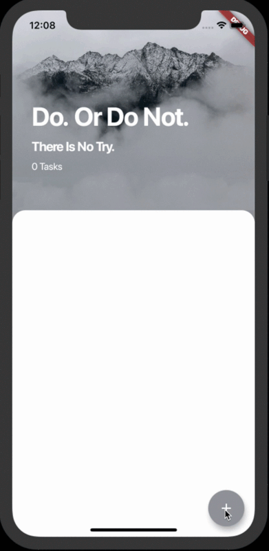

# To-Do App ✓

A simple To-Do App in Flutter that demonstrates managing state using the Provider package. Use this inspirational To-Do app to keep track of all your tasks and organize your life!

This app is inspired by the projects on The App Brewery's Complete Flutter Development Bootcamp. Check out the full course at www.appbrewery.co
